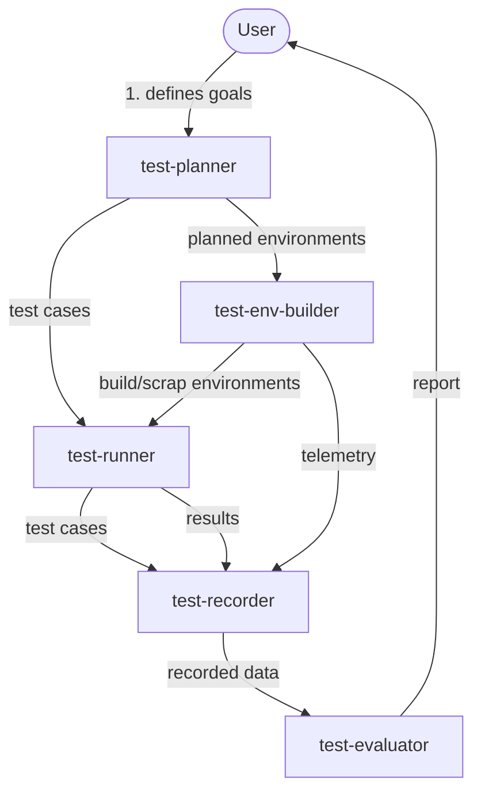

# test-orchestrator

A framework for systems infrastructure testing.

test-orchestrator coordinates the end-to-end lifecycle of infrastructure
tests: planning what to test, building the environment to test in, running
the tests, recording what happened, and evaluating the results.

## Workflow

The user first uses `test-planner` to create a testing plan: planned
testing environments (for `test-env-builder`) and test cases (for
`test-runner`). From there, `test-env-builder` builds and scraps testing
environments, `test-runner` runs the test cases, and `test-recorder`
records test cases, results, and telemetry throughout. Once testing is
done, `test-evaluator` evaluates what `test-recorder` captured and
reports back to the user.

## Subprojects

Each of these lives in its own Git repository and is checked out as a
sibling directory here (ignored by this repo's `.gitignore`):

- `test-planner` — determines what tests to run and in what order
- `test-env-builder` — provisions/tears down the infrastructure under test
- `test-runner` — executes tests against a provisioned environment
- `test-recorder` — captures logs, metrics, and artifacts from test runs
- `test-evaluator` — analyzes results and determines pass/fail

## Status

Early stage. Structure and interfaces between subprojects are still being
defined.
